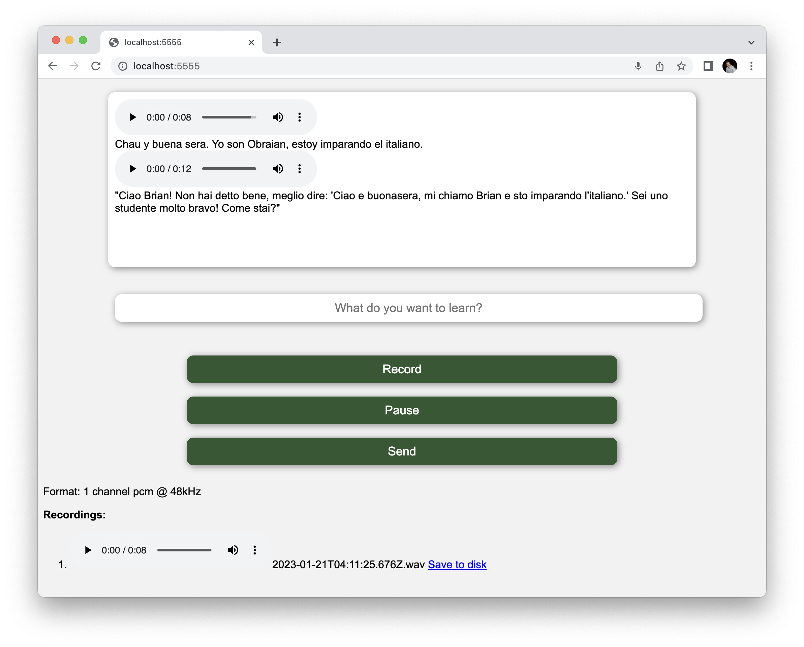

# AI Language Learning Tutor [ScaleAI Hackathon]

This is an application for interactive language learning. It's something [I've](https://www.twitter.com/brian_mount)
wanted for a while, especially since my free time to learn languages does not have any time zone overlap with any
available instructors in Europe.

The main idea is to be a conversation partner who is able to make corrections and explain things.
Here is what it looks like so far (click through for video):

## Setup

We rely on 2 external services that require authentication (and likely a modest payment):

1. OpenAI's GPT API.
2. Google Cloud's text-to-voice synthesis.

Authentication to OpenAI is handled by setting the environment variable `OPENAI_API_KEY`
to your API key. Expect to incur order of $0.01 in charges per interaction.

Authentication and authorization to Google is covered in the script `tts-setup.sh` (where
'tts' is short for 'text to speech'.) GCP also requires a Google account of some kind.

## Building and Running

Typing `make` from the project root should download and build everything and start the server.
It will also set up a service account that will be used for GCP text-to-speech. (Or, at
least, any missing pieces -- compilers or cloud accounts etc -- should be explained if any
step fails.)

### License: MIT

### Screenshot

